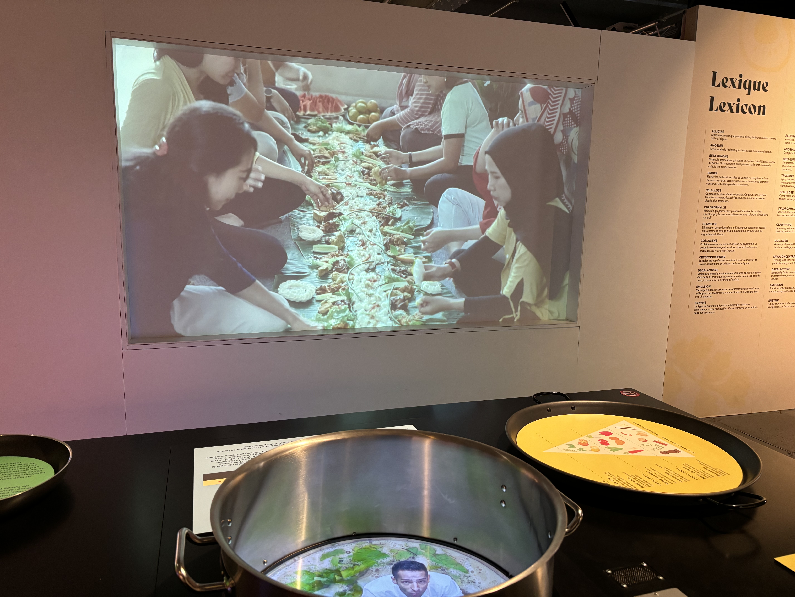
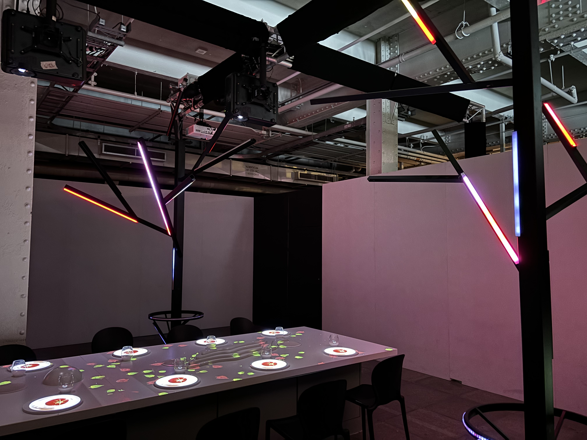

# Exposition interactive Banquet

Image du devant du Centre des sciences

## **Presentation du Banquet**
Le Banquet est une experience interactive multimédia au Centre des sciences au vieux port de Montréal. Cette exposition fascinante nous fait vivre une experience éducative et intéressante sur le monde culinaire et la gastronomie. L'oeuvre se sert de dispositifs et d'installations interactive afin de faire participer son publique et créer un apprentisage enrichissant. 

J'ai visité le centre des sciences le 9 février ou j'ai visité le Banquet, une exposition qui fut installé du 16 mai au 16 mars 2025. C'est une oeuvre qui peut durer une vingtaine de minutes dépendant de la vitesse que vous passez à chaque dispositif. C'est une installation sur plusieurs pièces et nécéssite aux visiteurs de marcher entre chaque dispositif.

Le premier dispositif présente deux un écran, un grand, et un dans un bol qui fait usage de la perspective. Une vidé instructive s'active avec l'intéractivité du visiteur. Les écrans sont accompagnés par deux haut-parleurs cachés qui accompagnent les deux écrans afin d'assurer un expérience complète pour tous. On peut aussi y trouver un bouton pour recommencer la vidéo. C'est une installation contemplative et enrichissante.

Photos des Boutons

Le Banquet inclue aussi un grande installation immersive multimédia autour d'une table de souper qui inclue plusieurs projecteurs et grand écrans qui diffusent de graphismes sur les murs et la table. La salle est éclairé par des batons lumineux colorés qui changent de couleur au court de l'expérience. Tout cela est accompagné de haut-parleurs pour integrer du son dans le tout pour assurer l'immersion. La pièce complète se retrouve recouverte de différents médias ce qui fait une très bonne expérience multimédia immersive.

Personnellement, j'ai trouvé mon expérience très interéssante mais ce n'est pas pour moi, le publique cible est plus pour les enfants ou les familles. Cependant, en tant qu'étudiant en intégration multimédia, j'ai trouver le travail effectué sur les installations super bien réussi et créatif. Pour ma part, ce que j'aurais fait autrement serais de raccourcir le videos instructives qui peuvent être longues et intégrer plus de sons dans les dispositifs.

Pour en apprendre plus sur le Banquet: https://www.centredessciencesdemontreal.com/exposition-temporaire/l-exposition-interactive-banquet
