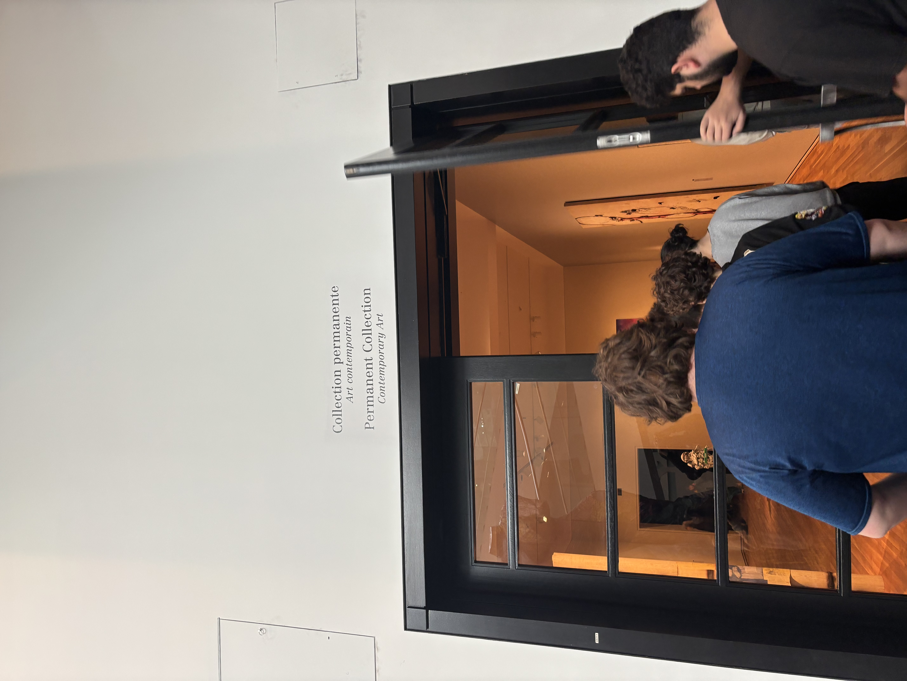
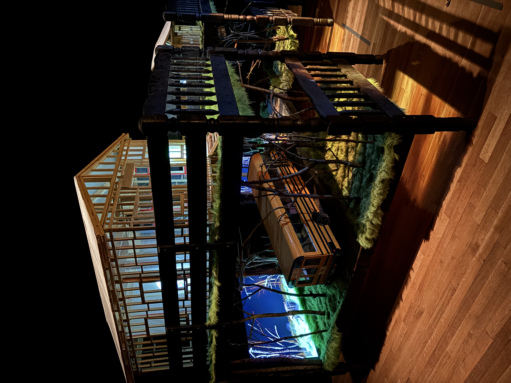
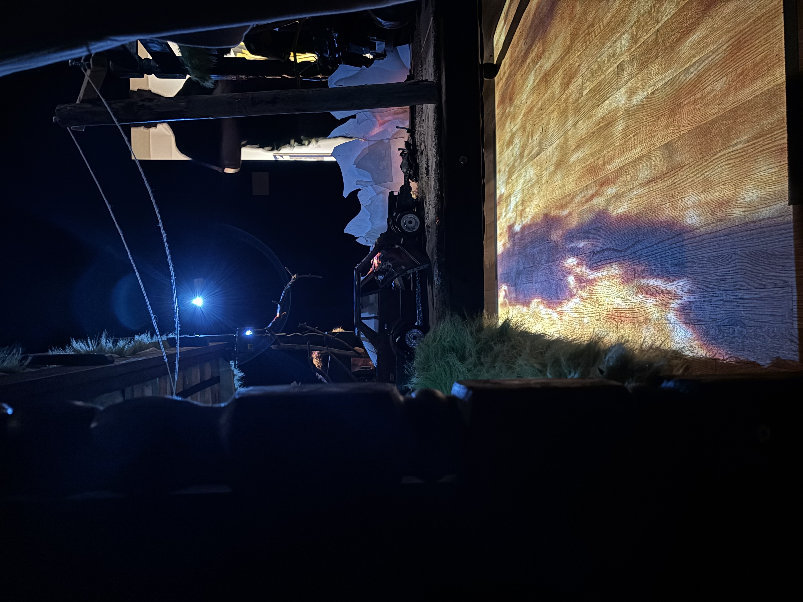

## **Camp Wakonda de Graeme Patterson**

 |   
:-------------------------:|:-------------------------:

*Photos prises par moi-même au MBAM*

Camp Wakonda de Graem Patterson est une oeuvre d'art contemporaine exposé au Musée des beaux-arts de Montréal. Ceci est la première fois que cette oeuvre fut exposé à ce musée, je l'ai visité le 3 Avril 2025. C'est une oeuvre passive exposé dans une exposition de type intérieure.

# Desciption

Camp Wakonda est une installation multimedia immersive qui mélange le son, la vidéo et la lumière dans une expérience fascinante. Créer en 2013, cette oeuvre est fait de sculptures construites placées sur deux lits d'enfants superposés. Elle est composée de minis sculptures comme de petits bonhommes, des maisons miniatures, un autobus d'écoles détruits,etc. 

 |   
:-------------------------:|:-------------------------:

*Photos prises par moi-même au MBAM*

Sur les lits se trouvait deux structure de maisons en bois et un accident de minis-voitures avec visiblement une projection d'une animation de feu projeté dessus et des haut parleurs sur le plafond pour simuler le bruit du feu. Les maisons contiennent des animations (quatres si je ne me trompes pas) fait en stop-motion représentant un personnage qui chasse un animal. La moitié de ces animations sont affichées sur des écrans, l'autre moitié est projeté sur des toiles. Un système branchements peuvent être aperçu en dessous des lits.

# Appréciation

 |   
:-------------------------:|:-------------------------:

Pour ma part, c'est une oeuvre que j'ai bien aimé mais sans plus. Son execution est très bonne, et la façon dont l'artiste à mélangé ces structures miniatures avec le multimédia comme le son et les animations stop-motion est super génial et brillant.
