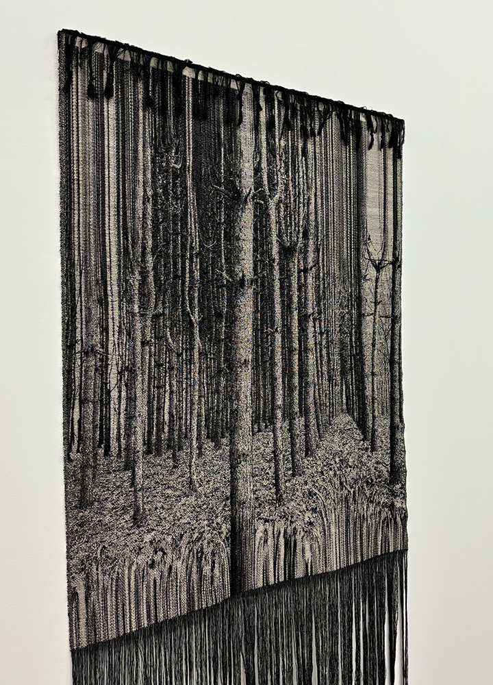
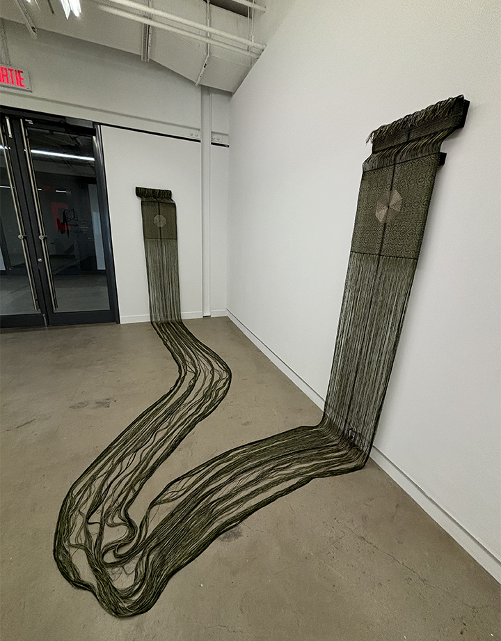
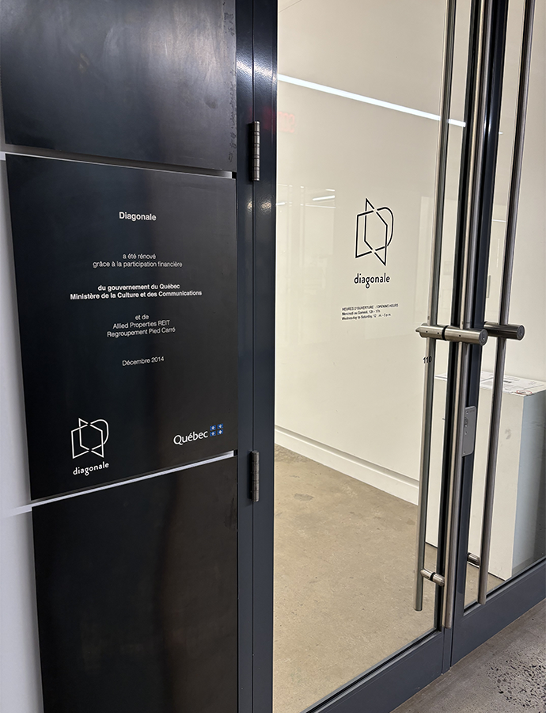
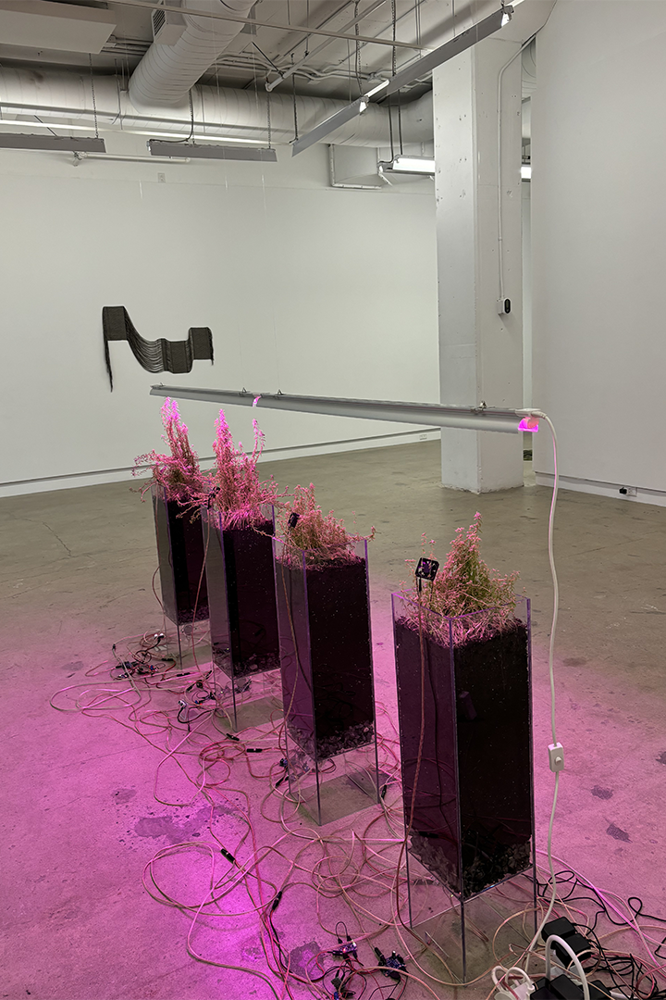
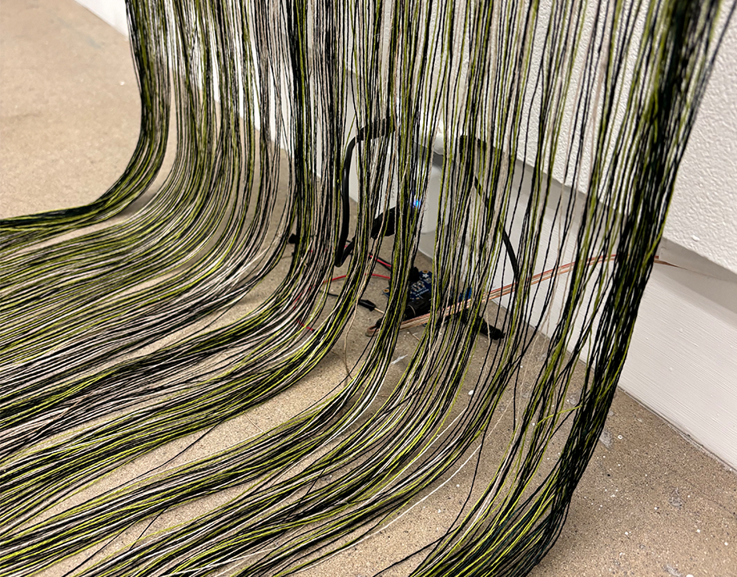

# Echos: Distortions sonores et motifs géométriques

 |  
:-------------------------:|:-------------------------:

*Photos prisent par moi-même à la galerie d'art Diagonale*

# Qu'est-ce que Échos?
Échos est une exposition temporaire réalisé par l'artiste textile et sonores Ryth Kesselring. Cette dernière fut exposé dans un centre de diffusion et d'arts contemporains,  la galerie d'art Diagonale à Montréal. J'ai visité la galerie le 28 février 2025. L'exposition complète se passe dans une pièce, qui prends environ 5 minutes a visiter et contempler les oeuvres (si on passe rapidement).

 
*Photo prise par moi-même à la galerie d'art Diagonale*

# Description de l'exposition
À travers son exposition, Ryth Kesselring nous permet de traverser le temps et de nous immerser dans une ambience d'une différente époque. Tout cela est réalisé grâce a des motifs artistique réalisé en tissu, de la végétation et du son ambient qui imitent les bruits d'autre époques et cultures. L'exposition contenait trois oeuvres qui, liées entre elle, permettait l'immersion voulu par l'artiste. 

# Les plantes 

 
*Photo prise par moi-même à la galerie d'art Diagonale*

Au plein millieu de l'exposition se trouvait quatres pots vitrés contenant une plante chacun. Ce dernier inclu une installation sonore contenant un haut parleur pour chaque plante, qui dégage un ambient de nature qui, selon les mots de l'artiste elle-même, sont des «rythmes qui émanent de différentes époque caractérisant un civilisation». Au dessus de ces plantes se trouve deux batons de lampes UV pour la croissance de la plante. Ce détail rajoute une forme d'intéractivité a l'oeuvre, une démonstration du temps qui passe, l'oeuvre n'est jamais la même à chaque visite car les plantes ne cessent de grandir. 

# L'art du tissu

 | 
:-------------------------:|:-------------------------:

*Photo prise par moi-même à la galerie d'art Diagonale*

Au début de l'exposition, on peut observer des toiles de tissus qui se connectent entre elles, il semblerait que ces fils sont des fils de connexion tissés faits par l'artiste. Un mini haut-parleur caché à l'arrière de la toile produit du son alors que les fils font des vibrations qui passent tout le long de leur connexion. 

# Appréciation

Pour ma part, j'ai bien apprécié cette exposition. Malgré sa nature plutôt abstraite selon moi, j'ai trouvé l'idée mais aussi le travail et l'originalité de Ryth Kesselring super intéressants et créatifs. L'incorporation du son ambient et les plantes sont mes parties préférées du tout, sans parler du talent indéniable de l'artiste pour l'art textile.
