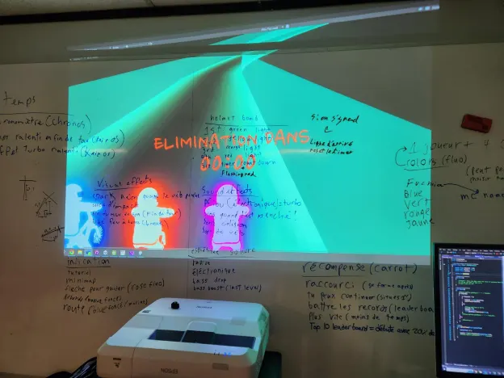

## **CON-DU8**

Logo condu8

## **Description**

CON_DU8 est un jeu de course immersive qui combine l'exercice aux jeux vidéo dans une expérience intense et divertissante. Cette installation interactive était mise en exposition dans le petit studio TIM au Collège Montmorency pendant la semaine du 17 mars 2025 dans le cadre de l'exposition << Résonance >>. C'est un dispositif intérieur réalisé par l'équipe d'étudiants composée de Ian Corbin, Samuel Desmeules Voyer, Alexandre Gervais, Kevin Malric et Jeremy Roy Coté. La façon dont C0N_DU8 fonctionne est simple, l'utilisateur monte sur le vélo installé en face de l'écran, et puis il se met à pédaler pour accélérer dans le jeu. Pour les virages, le joueur doit simplement incliner son corps vers le côté souhaité afin de pouvoir tourner. Le but du jeu est de simplement gagner des courses contre des IA et de compléter des niveaux. C'est un fonctionnement simple mais aussi extrêmement efficace qui permet une immersion garantie à l'utilisateur. J'ai visité ce dispositif le 18 mars 2025. 

## **Installation**
	
 | MISE EN ESPACE | PROJECTION |
| ----------- | ----------- |
|||

Installation dans le petit studio

## Fonctionnement

La disposition de l'expérience C0N-DU8 peut sembler complexe, hélas elle reste plutôt simple. Tout d'abord, le jeu en lui-même fut créé de A à Z sur le logiciel Unity. Ensuite, l'équipe a fait usage d'un vélo stationnaire qui, grâce à un câble lié à un voltmètre, envoie des données OSC (Open Sound Control) vers un ordinateur situé derrière l'écran de projection. Ainsi, le logiciel utilisé reçoit ces données et peut déterminer la vitesse de l'utilisateur. De plus, une Kinect (caméra de détection faite pour jeux vidéo) est installée au-dessus de l'écran vers le joueur. Elle a pour but de capturer les mouvements horizontaux du joueur pour effectuer des virages, elle envoie ses données vers l'ordinateur qui, sur le même logiciel arrive à déterminer lorsqu'un joueur effectue un virage et vers quel côté. Pour finaliser le tout, un projecteur avec des câbles liés à l'ordinateur est placé sur le toit, au-dessus de l'uttilisateur afin de diffuser le jeu devant le joueur. Pour finaliser le tout, deux haut-parleurs sont placés à côté de la Kinect, diffusent des sons interactifs du jeux ainsi que de la musique créer par l'équipe à partir du logiciel Reaper. 

## **Schéma**

Photo du schéma réalisé par l'équipe

## **Expérience vécue**

Je me suis senti super immergé dans leur dispositif. La jouabilité est l'une des plus cool que j'ai vue et c'est un dispositif qui réussit avec excellence à épater ses utilisateurs. L'équipe derrière ce projet a bien réussi à intégrer chaque aspect du multimédia dans une expérience unique et divertissante pour chaque visiteur. Je n'ai pas vécu de bugs ou n'importe quel autre problème lors de mon expérience, cependant, c'est effectivement un dispositif qui prend énormément d'énergie et est très fatigant. Je comprends que pas tout le monde peut apprécier le dispositif pour cette raison, et donc, personnellement, à leur place je rendrais l'expérience plus accessible à tous et je réduirais aussi la vitesse à laquelle le jeu bougeait, car en effet tout dans l'écran se déplaçait beaucoup trop vite.
