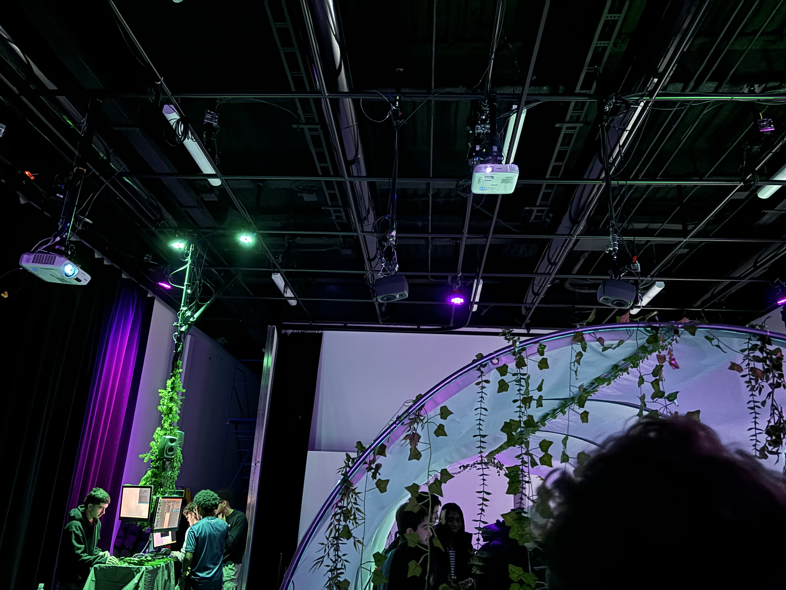
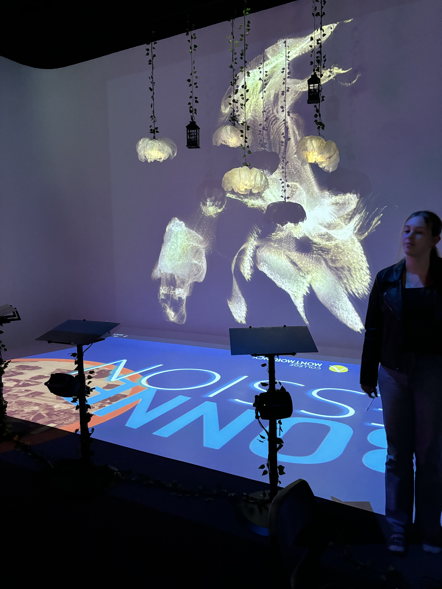
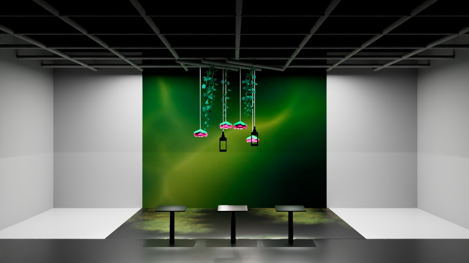
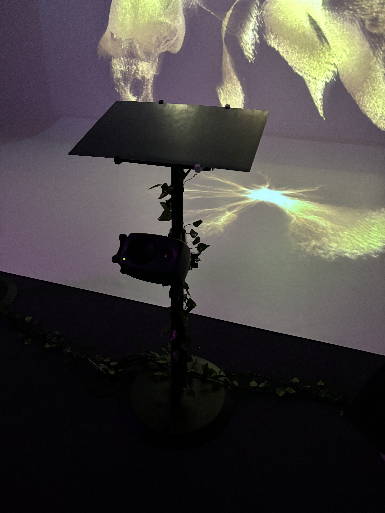
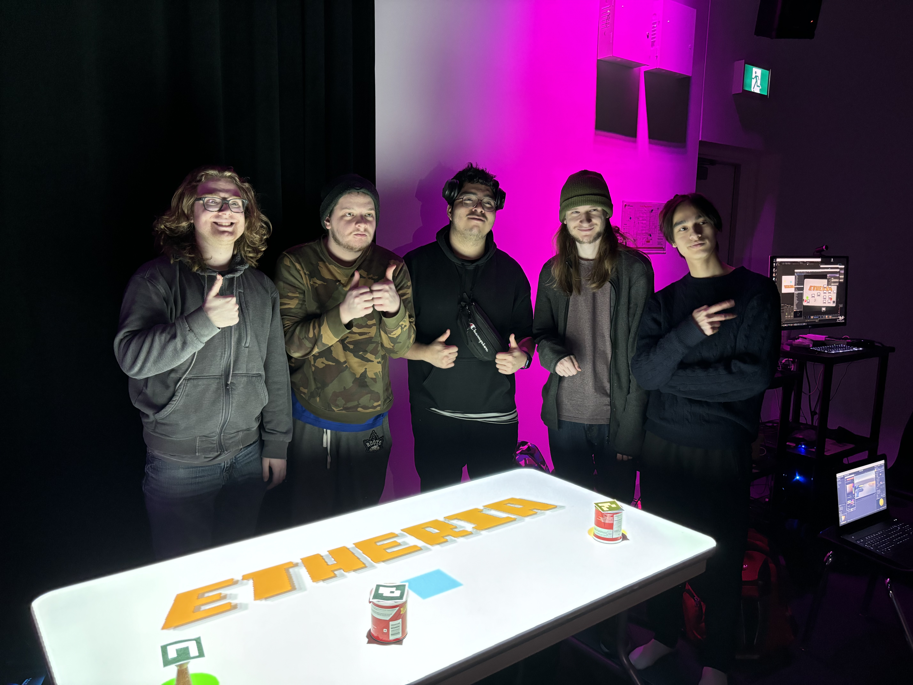
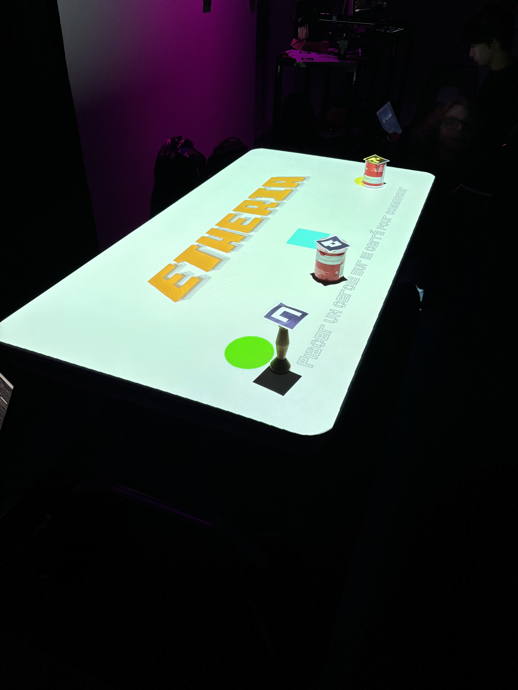
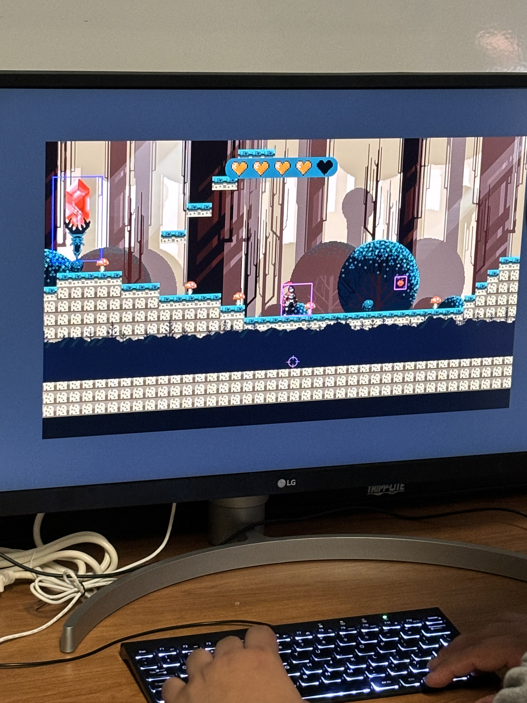
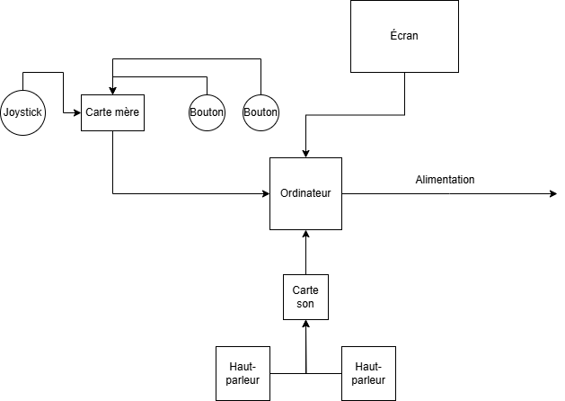
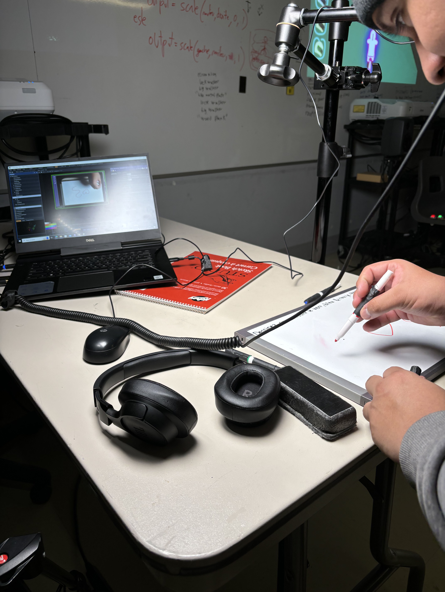
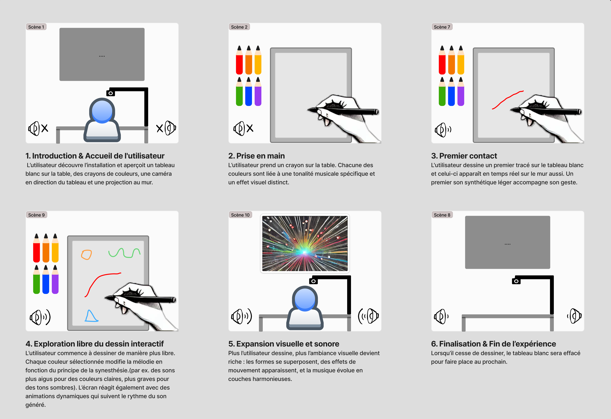

# Projets des finissants en multimédias

 

Photo de l'installation du Grand studio le 25 février 2025

## **Ordre de préférence**
1. Internature
2. Luminatura
3. Arcadia
4. Etheria
5. Prismatica
6. C0NDU8
7. FUGA

## **Les projets**

Les finissants dans la technique d'intégration multimédia font un projet d'oeuvre interactive qu'ils vont mettre en exposition à la fin de session. Tous ces oeuvres font partis de l'exposition Résonance. Nous avons visités leurs installations en progrès le 25 février 2025. Ce sont des projets d'équipe qui se font en 8 semaines ou ils doivent mettre en expositions leurs expertises acquis au courant de leur parcours collégiale.

# Luminatura

Photo de l'installation en cours de création
## **Description**

Luminatura est un projet qui combine l'art et la technologie. La natures et des lanternes en décorations qui changent de couleur et déclenche la lumière au toucher de la main. Le tout fonctionne à partir de trois plaques métalliques qui sert de capteur capacitif qui détecte la conductivité des mains, allume les deux lampes et activent des sons sur un haut parleur accroché sur le toit. Le son est toujours différent en fonction de la capacitance des mains, cela fut surement fait à partir d'un logiciel de programmation qui choisit entre différents sons déja fait pour en jouer quelques uns en même temps mais de manière aléatoire à chaque fois. Dèrriere tout cela, un projecteur diffuse sur le grand mur un graphisme de couleurs qui bouge fait à partir du logiciel TouchDesigner, ce dernier est aussi différent à chaque toucher de mains. L'oeuvre m'a émerveillé, les graphismes et leur intéractivité est très bien réussi.

## **Simulation**

Simulation du résultat final

Plaque métallique qui sert de capteur capacitif qui détecte la conductivité des mains.

# Etheria

Photo de l'équipe derrière le projet Etheria

## **Description**

Un installation interactive en pixel qui permet au joueurs de découvrir un univers virtuel avec une jouabilité unique. 
J'ai trouvé l'expérience super intéréssante et amusante malgré le manque de clarté lors du première essaie du jeu. Ce jeu m'a rappelé énormément des vieux jeux rétro d'arcade. 

Le dispositf en cours de création

## **Schéma**

Schema du résultat final

# Arcadia

Photo de l'installation en cours de Arcadia

## **Description**

Arcadia est une oeuvre interactif qui a pour but de simuler les jeux d'arcade rétro et d'offrir une expérience nostalgique et amusante. L'équipe a super bien recrée la ressentiment nostalgique d'un jeu d'arcade rétro avec leurs graphismes pixelisé et leurs boutons simplifiés qui rends la jouabilité facile mais amusante.

## **Schéma**

Le schema démontre biien le fonctionnement de l'installation cependant il manque peut-être de support visuel du résultat final voulu. 

## **Prismatica**

Photo de l'installation en cours de création

## **Description**

Oeuvre qui transforme le dessin de l'utilisateur en un graphisme visuel avec du son et le projette sur un tableau blanc. Je trouve l'idée très intéréssante et créative cependant j'ai trouvé que l'oeuvre ne réussi pas crée le le sentiment artistique qu'il essaye de transmettre aux utilisateurs. Les graphismes qui se  crée sur le tableau sont basiques et peu intéréssant et le temps de délai entre le dessin et la projection du résultat rends l'éxpérience moins authentique et immersive. 

## **Schéma**

## **CON-DU8**

Photo de CON-DU8 en cours de création

## **Description**

CON_DU8 est une jeu de course immersive qui combine l'exercie au jeux vidéos dans une expérience intense et divertissante. Je me suis senti super immersé dans leur dispositif. La jouabilité est l'une des plus cool que j'ai vu et c'est un dispositif qui réussi avec excellence à épaté ces uttilisateurs. 

## **Schéma**

