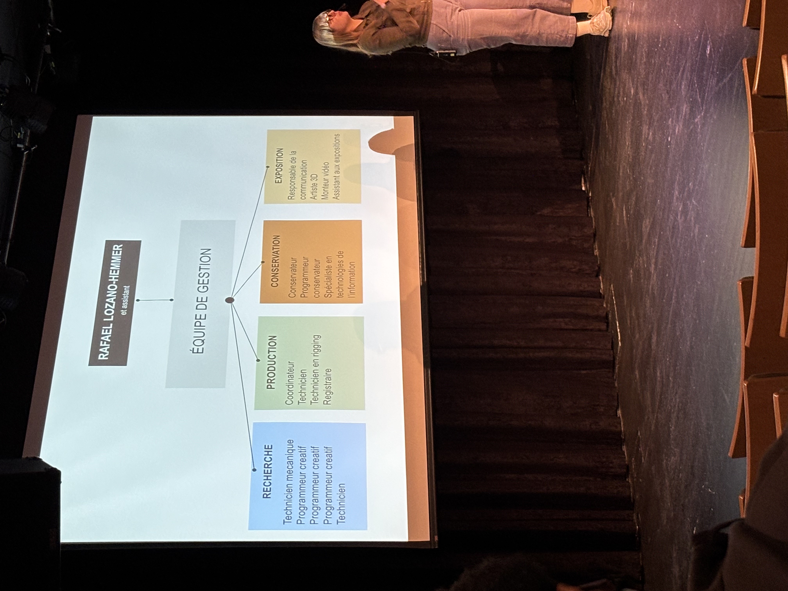
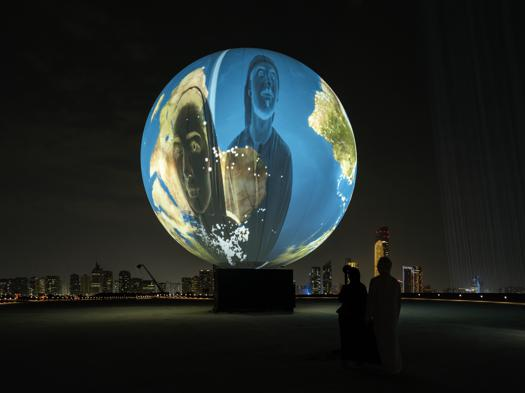

## **Conférence de Jade Séguela**

Image prise par moi-même lors de la conférence.

# Description de la conférence

Jade Séguela, la registraire de l'artiste multimédia canadien Rafael Lozano-Hemmer, à présenter une conférence informative sur son métier le 25 mars 2025 au collège Montmorency. Elle a parlé de l'organisation, la gestion, les implications de son métier et aussi de l'historique de son travail au sein de son entreprise.

Pour démarrer, Jade Séguela a parlé de l'ensemble des rôles et des métiers impliqués. En premier, il y a l'artiste Rafael Lozano-Hemmer et son assistant, ensuite on retrouve l'équipe de gestion qui s'occupe de gérer des quatre grandes étapes de leurs processus : la recherche, la production, la conservation et l'exposition. Elle nous a partagé le processus de travail ainsi que la chronologie de la vie d'une oeuvre en partant de sa création jusqu'à sa fin, qui peut être potentiellement achetée ou bien entreposée. Jade Séguela a aussi expliqué ce qu'est une registraire et quel est son rôle. Additionnellement, elle a présenté certaines oeuvres auxquelles elle a participé au développement. Une oeuvre qui m'a marqué est celle nommée Shadow Tuner, une oeuvre de 2023 qui est un énorme globe de la terre qui change de station de radio dépendant d'où l'ombre de l'utilisateur est projetée.   

Rafael Lozano-Hemmer, "Shadow Tuner", 2023. Photo by: Lance Gerber (https://www.lozano-hemmer.com/shadow_tuner.php)

## **Appréciation**
Ce fut une conférence que j'ai personnellement beaucoup appréciée. Elle fut très instructive et claire dans ses propos, mais c'était aussi une conférence très inspirante et motivante en tant qu'étudiant dans le domaine. Elle m'a aussi permis d'acquérir des connaissances sur le fonctionnement, le travail et les efforts mis dans une oeuvre artistique exposée.  
